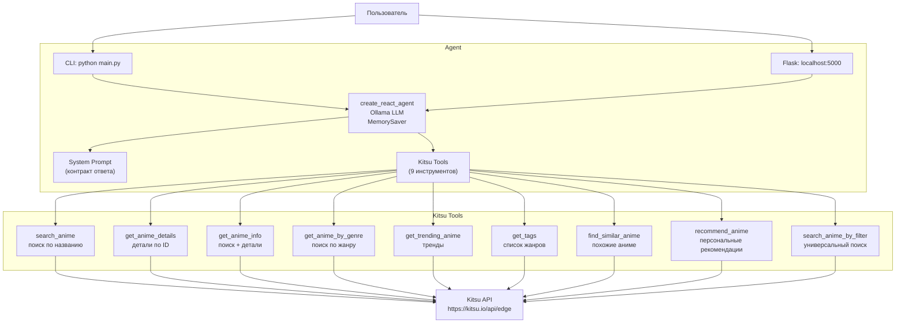

# LangChain Anime Recommendation Agent

AI-агент для подбора аниме через естественный язык, использующий Kitsu API.

## Возможности

- Поиск аниме по названию
- Получение детальной информации об аниме по названию
- Подбор аниме по жанру
- Получение списка популярных аниме
- Рекомендации на основе предпочтений пользователя
- Поддержка сессионной памяти (контекст в рамках диалога)

## Технологии

- **LangChain** + **LangGraph** (ReAct agent)
- **Ollama** (llama3.1:8b, локально)
- **Kitsu API** (публичное API, не требует ключа)
- **Flask** (web-интерфейс)

## Архитектура



## Установка

### 1. Требования

- Python 3.10+
- Ollama (запущен локально)
- uv (опционально, для управления зависимостями)

### 2. Настройка Ollama

```bash
# Установите Ollama, если ещё не установлен
# https://ollama.com/download

# Скачайте модель (по умолчанию llama3.1:8b)
ollama pull llama3.1:8b

# Запустите сервер Ollama
ollama serve
```

### 3. Установка зависимостей

```bash
# Создать виртуальное окружение (если используется uv)
uv venv
source .venv/bin/activate

# Установить зависимости
uv pip install -r requirements.txt
```

### 4. Конфигурация

```bash
# Скопировать пример конфигурации
cp .env.example .env

# При необходимости отредактировать .env:
# OLLAMA_BASE_URL=http://localhost:11434
# OLLAMA_MODEL=llama3.1:8b
# FLASK_PORT=5000
# FLASK_DEBUG=true
# DEBUG=false
```

## Запуск

### CLI (одиночный запрос)

```bash
python main.py "Найди аниме Cowboy Bebop"
```

### CLI (интерактивный режим)

```bash
python main.py --interactive
```

### CLI с выбором модели

```bash
python main.py --model llama3.2:3b "Найди аниме Cowboy Bebop"
python main.py -m mistral:7b --interactive
```

Флаг `--model` / `-m` переопределяет модель Ollama, указанную в `.env` (`OLLAMA_MODEL`).
По умолчанию используется `llama3.1:8b`.

### CLI с DEBUG-выводом

```bash
python main.py --debug "Найди аниме Cowboy Bebop"
python main.py -d --interactive
```

Флаг `--debug` / `-d` включает вывод отладочной информации о вызовах инструментов Kitsu API.
DEBUG также можно включить через переменную окружения `DEBUG=true` в `.env`.

### Flask Web UI

```bash
python -m web.app
# или
python -c "from web.app import create_app; create_app().run(host='0.0.0.0', port=5000, debug=True)"
```

Затем откройте http://localhost:5000 в браузере.

## Контракт ответа

Агент всегда отвечает в фиксированном формате:

```text
Status: success | error
Action: <описание того, что было сделано>
Data: <результат работы, информация об аниме, рекомендации>
Errors: <если были ошибки, иначе "нет">
```

Где:
- `Status: success` — операция выполнена успешно
- `Status: error` — произошла ошибка
- `Action` — краткое описание выполненного действия
- `Data` — информация об аниме, рекомендации или результат поиска
- `Errors` — описание ошибки или "нет"

## Используемые инструменты (Tools)

| Инструмент | Описание | Пример вызова |
|------------|----------|---------------|
| `search_anime` | Поиск по названию | "найди Cowboy Bebop" |
| `get_anime_details` | Детали по ID | "расскажи про аниме с id 1" |
| `get_anime_info` | Полная информация об аниме по названию (поиск + детали в одном шаге) | "расскажи про аниме Naruto" |
| `get_anime_by_genre` | Поиск по жанру | "подбери аниме в жанре комедия" |
| `get_trending_anime` | Популярные аниме | "что сейчас популярно?" |
| `get_tags` | Список доступных жанров | "какие жанры есть?" |
| `find_similar_anime` | Похожие аниме, исключая франшизу | "найди похожее на Cowboy Bebop" |
| `recommend_anime` | Персональные рекомендации | "мне понравилось Cowboy Bebop и Evangelion" |
| `search_anime_by_filter` | Универсальный поиск (жанр, категория, человек, студия) | "найди аниме студии Ghibli" |

## Реализация API-tool (критерий оценки #2)

- **Файл:** `tools/kitsu_tools.py`
- **Строки:** L463-L1434 (все 9 инструментов)
- **Реальный HTTP-вызов:** `tools/kitsu_tools.py:L60-L72` (функция `_make_request`)
- **Debug-вывод:** `logging.debug()` в каждой функции-инструменте, управляется через `--debug` CLI флаг или `DEBUG=true` в `.env`

## Тестовые запросы

| # | Запрос | Ожидаемый инструмент | Статус |
|---|--------|---------------------|--------|
| 1 | "Найди аниме Cowboy Bebop и покажи информацию о нём" | `search_anime` | ✅ |
| 2 | "Покажи топ популярных аниме" | `get_trending_anime` | ✅ |
| 3 | "Подбери аниме в жанре комедия" | `get_anime_by_genre` | ✅ |
| 4 | "Я смотрел Cowboy Bebop, мне понравилось. Что ещё посмотреть?" | `search_anime` | ✅ |
| 5 | "Расскажи про аниме Naruto" | `get_anime_info` | ✅ |

## Используемые промпты

### Системный промпт

Полный текст системного промпта находится в файле `agent/prompts.py` (строки L9-L216).

Ключевые элементы:
- Роль агента: AI-ассистент для подбора аниме через Kitsu API
- Ограничения: только чтение, никаких действий вне компетенции
- Правила вызова инструментов: всегда использовать API, не выдумывать данные
- Формат ответа: Status/Action/Data/Errors
- Язык ответа: отвечать на языке пользователя, переводить synopsis/description из API

## Безопасность

- API-ключи не требуются (Kitsu API публичное)
- Секреты не коммитятся (.env в .gitignore)
- В production измените `secret_key` в `web/app.py`

## Лицензия

Учебный проект для курса "ИИ для разработчиков".