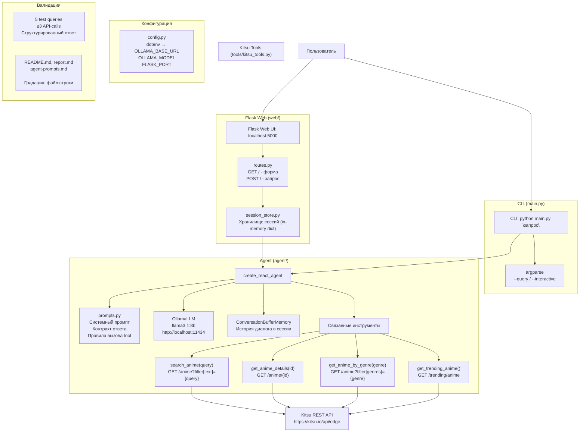

# План разработки: LangChain Anime Recommendation Agent

## Архитектура агента



## Структура директории

```
/home/ai/00/langchain/
├── main.py                    # CLI entry point
├── config.py                  # Environment config loader
├── requirements.txt           # Python dependencies
├── .env.example               # Example env config
├── .gitignore                 # .env, __pycache__, etc.
├── agent/
│   ├── __init__.py
│   ├── agent.py               # create_react_agent setup
│   └── prompts.py             # System prompt + templates
├── tools/
│   ├── __init__.py
│   └── kitsu_tools.py         # 4 Kitsu API tools
├── web/
│   ├── __init__.py
│   ├── app.py                 # Flask app factory
│   ├── routes.py              # GET / (form), POST / (query)
│   ├── templates/
│   │   └── index.html         # Minimal form + results
│   └── session_store.py       # In-memory session storage
├── memory-bank/               # Memory Bank (существующие файлы)
├── PROMPTS.md                 # История промптов
├── CHANGES.md                 # История изменений
├── README.md                  # Документация проекта (отчёт)
├── report.md                  # Короткий отчёт для сдачи ДЗ
└── agent-prompts.md                 # Все использованные промпты
```

## Пошаговый план (11 шагов)

Каждый шаг включает:
- Написание/изменение кода
- Обновление memory-bank (activeContext.md, progress.md)
- Запись в CHANGES.md
- Запись в PROMPTS.md
- Валидация (запуск/проверка)

---

### Шаг 1: Конфигурация окружения

- Создать `requirements.txt` (langchain>=0.3, langchain-ollama, requests, python-dotenv, flask)
- Создать `.env.example` (OLLAMA_BASE_URL, OLLAMA_MODEL, FLASK_PORT, FLASK_DEBUG)
- Создать `.gitignore` (venv/, .env, __pycache__/, *.pyc)
- Создать `config.py` — загрузка переменных через python-dotenv
- **Валидация:** `uv pip install -r requirements.txt`
- **Обновить:** memory-bank, CHANGES.md, PROMPTS.md

### Шаг 2: Kitsu API инструменты (tools/kitsu_tools.py)

- Реализовать 4 LangChain-инструмента с `@tool`:
  1. `search_anime(query: str)` — поиск по названию/ключевым словам
  2. `get_anime_details(anime_id: int)` — детальная информация по ID
  3. `get_anime_by_genre(genre: str)` — подборка по жанру
  4. `get_trending_anime()` — популярные сейчас
- Цепочка search_anime → get_anime_details для сценария "информация об аниме по названию" реализована через system prompt (правило 5 в agent/prompts.py)
- Каждый инструмент: HTTP-запрос `requests.get()`, `print()` для дебага, возврат `{"status": ..., "data": ..., "action": ..., "errors": ...}`
- **Валидация:** `python -c "from tools.kitsu_tools import search_anime; print(search_anime('Cowboy Bebop'))"` 
- **Обновить:** memory-bank, CHANGES.md, PROMPTS.md

### Шаг 3: Системный промпт и шаблоны (agent/prompts.py)

- Системный промпт: роль агента, описание инструментов, контракт ответа, ограничения
- Шаблон для форматирования ответа (Status/Action/Data/Errors)
- **Валидация:** импорт без ошибок
- **Обновить:** memory-bank, CHANGES.md, PROMPTS.md

### Шаг 4: Сборка агента (agent/agent.py)

- `create_react_agent` с OllamaLLM, инструментами, memory
- Функция `process_query(query: str, session_id: str = None) -> str`
- **Валидация:** `python -c "from agent.agent import process_query; print(process_query('найди аниме Cowboy Bebop'))"`
- **Обновить:** memory-bank, CHANGES.md, PROMPTS.md

### Шаг 5: CLI entry point (main.py)

- argparse: `python main.py "запрос"` или `python main.py --interactive` для диалогового режима
- Интерактивный режим: цикл ввода/вывода, сессия сохраняется до `exit`
- **Валидация:** запуск CLI с тестовым запросом
- **Примечание:** Пункт изначально назывался "Детали по ID". Теперь заменён на "Информация об аниме" — реализован через новый инструмент get_anime_info(name), который сам выполняет поиск + получение деталей (Вариант A, выбран после того, как LLM не справилась с цепочкой из двух инструментов)
- **Обновить:** memory-bank, CHANGES.md, PROMPTS.md

### Шаг 6: Flask Web UI (web/)

- `web/app.py` — Flask factory
- `web/routes.py` — GET / (форма), POST / (обработка запроса с сохранением сессии)
- `web/session_store.py` — in-memory dict: session_id → chat_history
- `web/templates/index.html` — минимальная форма (textarea + submit), вывод ответа в структурированном виде
- **Валидация:** `python -m web.app`, открыть localhost:5000, ввести запрос
- **Обновить:** memory-bank, CHANGES.md, PROMPTS.md

### Шаг 7: Интеграционные тесты (5 запросов)

Выполнить 5 тестовых запросов (оба интерфейса):
1. `"Найди аниме Cowboy Bebop и покажи информацию о нём"` → API-call: `search_anime`
2. `"Покажи топ популярных аниме"` → API-call: `get_trending_anime`
3. `"Подбери аниме в жанре комедия"` → API-call: `get_anime_by_genre`
4. `"Я смотрел Cowboy Bebop, мне понравилось. Что ещё посмотреть?"` → API-call: `search_anime` (поиск похожих по жанру)
5. `"Расскажи про аниме Naruto"` → API-call: `get_anime_info`
- Зафиксировать результаты в `report.md`
- **Обновить:** memory-bank, CHANGES.md, PROMPTS.md

### Шаг 8: Документация README.md

- Полная документация: описание, установка, настройка, запуск
- Раздел "Контракт ответа" (для критерия оценки №4)
- Раздел "Использованные промпты" (ссылка на agent-prompts.md)
- Mermaid-схема архитектуры
- **Валидация:** визуальная проверка
- **Обновить:** CHANGES.md, PROMPTS.md

### Шаг 9: Отчёт report.md

- Короткий отчёт для сдачи ДЗ
- Какой LLM используется и как настроить
- Какое API выбрано и какие операции
- Как запустить (CLI + Flask)
- 5 тестовых запросов и результаты
- Ссылки на строки кода для критериев оценки (files:lines)
- **Валидация:** все критерии оценки покрыты
- **Обновить:** CHANGES.md, PROMPTS.md

### Шаг 10: Документация промптов agent-prompts.md

- Системный промпт (полный текст)
- Шаблоны пользовательских запросов
- **Валидация:** соответствие criteria #6
- **Обновить:** CHANGES.md, PROMPTS.md, memory-bank

### Шаг 11: Финальная верификация

- Проверить отсутствие секретов в репозитории
- Проверить `.env.example` без реальных ключей
- Проверить `requirements.txt` актуален
- CLI работает: `python main.py "тест"`
- Flask работает: `python -m web.app`
- Проверить все 6 критериев оценки
- Финальное обновление memory-bank, CHANGES.md, PROMPTS.md
- `uv pip freeze > requirements.txt` — фиксация зависимостей

---

## Соответствие критериям оценки

| Критерий | Как выполняется |
|----------|----------------|
| 1. Агент запускается | `python main.py "запрос"` или Flask → localhost:5000 |
| 2. API-tool с вызовом | `tools/kitsu_tools.py:Lxx-Lxx` + `print()` внутри каждой функции |
| 3. Интерпретация запросов | System prompt направляет LLM; тест: "найди аниме Cowboy Bebop" → `search_anime`; "расскажи про Naruto" → `get_anime_info` |
| 4. Контракт ответа | Описан в `README.md` (раздел "Контракт ответа") и `agent/prompts.py` |
| 5. 5 проверочных запросов | В `report.md` и `README.md` |
| 6. Промпты оформлены | `agent-prompts.md` |
| 7. Секреты не закоммичены | `.env` в `.gitignore`, `.env.example` без ключей |
