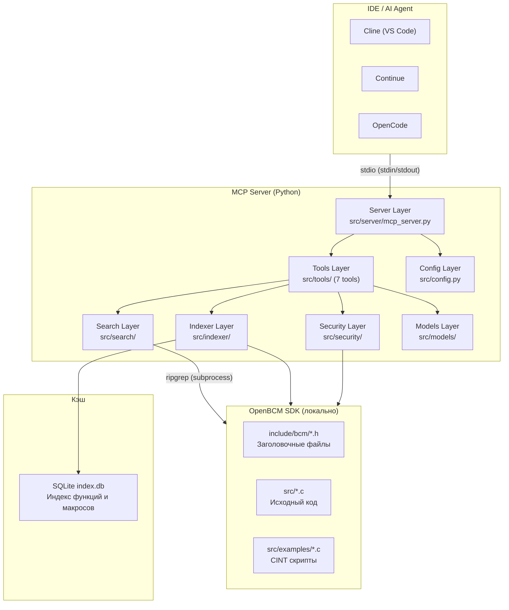
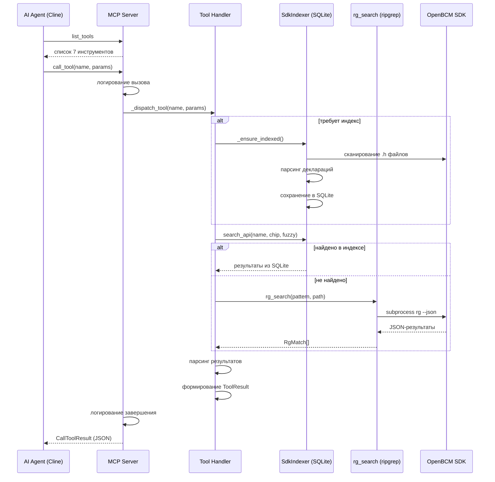
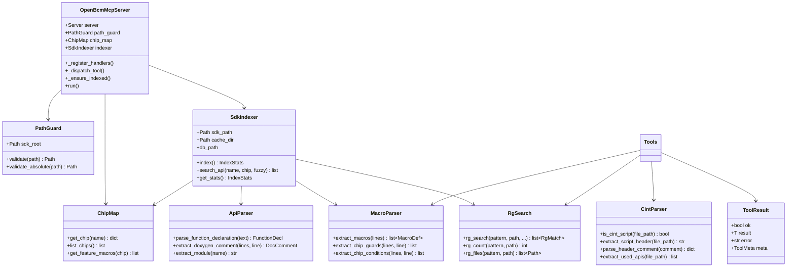
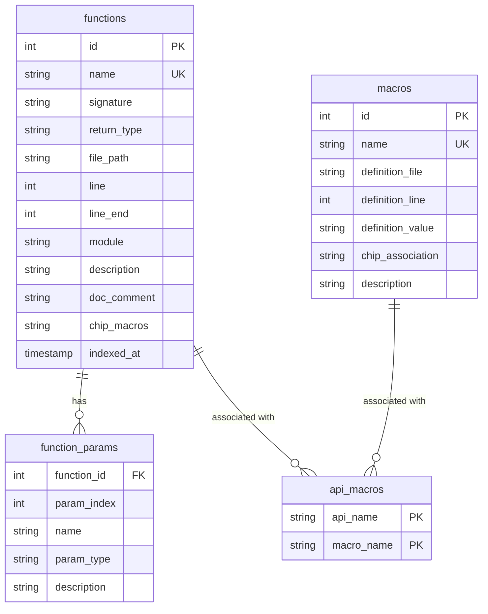
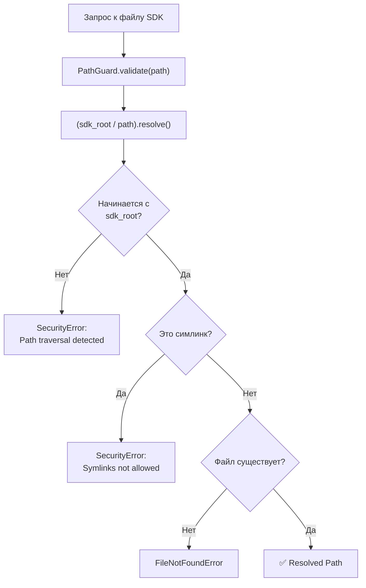
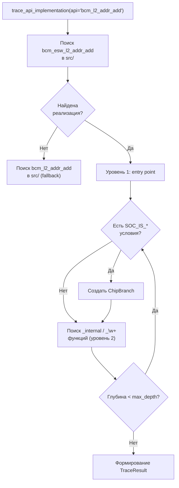

# Архитектура OpenBCM Helper MCP Server

## Общее описание

**OpenBCM Helper MCP Server** — это MCP-сервер для навигации по OpenBCM SDK. Он помогает AI-ассистентам (Cline, Continue, OpenCode) находить API, искать примеры использования, трассировать цепочки реализации и получать информацию о доступности функций на разных ASIC.

Сервер реализует протокол MCP (Model Context Protocol) через stdio-транспорт и предоставляет 7 инструментов для работы с SDK.

---

## 1. Общая архитектура



---

## 2. Sequence-диаграмма запроса



---

## 3. Компонентная диаграмма модулей



---

## 4. ER-диаграмма SQLite



---

## 5. Диаграмма безопасности (PathGuard)



---

## 6. Диаграмма потока трассировки



---

## 7. Принцип работы

### MCP протокол

1. **Инициализация**: IDE запускает MCP-сервер как дочерний процесс через stdio
2. **list_tools**: IDE запрашивает список доступных инструментов, сервер возвращает 7 инструментов с JSON Schema
3. **call_tool**: IDE вызывает инструмент с именем и параметрами, сервер выполняет логику и возвращает структурированный JSON

### Жизненный цикл запроса

1. **Логирование вызова** — имя инструмента, параметры (исключая чувствительные)
2. **Ленивая индексация** — при первом вызове `ping`, `get_sdk_info` или `find_bcm_api` запускается индексация SDK
3. **PathGuard** — все пути к файлам SDK проходят проверку безопасности
4. **Поиск** — сначала в SQLite-индексе, при отсутствии результатов — fallback через ripgrep
5. **Парсинг** — результаты обрабатываются парсерами (api_parser, macro_parser, cint_parser)
6. **Формирование ответа** — структурированный JSON с полями `ok`, `result`, `meta`
7. **Логирование завершения** — статус, время выполнения

### Безопасность

- **Read-only**: сервер только читает файлы SDK, никогда не пишет
- **Sandbox**: все пути проходят через `PathGuard.validate()`
- **Subprocess whitelist**: разрешена только команда `rg` (ripgrep)
- **Path traversal**: блокируются `..`, симлинки наружу, абсолютные пути вне SDK_ROOT

---

## 8. Технологический стек

| Компонент | Технология | Назначение |
|-----------|-----------|------------|
| Язык | Python 3.13+ | Основной язык |
| MCP протокол | `mcp` ≥1.0.0 | MCP Python SDK |
| Валидация | `pydantic` ≥2.0 | Схемы данных |
| Конфигурация | `pydantic-settings` ≥2.0 | Загрузка из env |
| Логирование | `structlog` ≥23.0 | Структурированное логирование |
| Нечёткий поиск | `rapidfuzz` ≥3.5 | Поиск по частичному совпадению |
| JSON | `orjson` ≥3.9 | Быстрая сериализация |
| БД | `sqlite3` (встроенный) | Лёгкий индекс SDK |
| Поиск | `ripgrep` (системный) | Быстрый текстовый поиск |
| Пакетный менеджер | `uv` | Управление зависимостями |
| Тестирование | `pytest` ≥8.0 | Unit + E2E тесты |

---

## 9. Переменные окружения

| Переменная | Обязательность | Дефолт | Описание |
|------------|---------------|--------|----------|
| `OPENBCM_SDK_PATH` | Да | — | Путь к корню SDK |
| `OPENBCM_MCP_LOG_LEVEL` | Нет | INFO | Уровень лога |
| `OPENBCM_MCP_CACHE_DIR` | Нет | ./cache | Директория кэша |

---

## 10. Структура проекта

```
src/
├── __main__.py              # Точка входа
├── __init__.py
├── config.py                 # Конфигурация из env (pydantic-settings)
├── server/
│   ├── __init__.py
│   ├── mcp_server.py         # MCP сервер (stdio) + регистрация 7 tools
│   └── logger.py             # structlog
├── tools/                    # 7 инструментов
│   ├── __init__.py
│   ├── ping.py               # Health-check
│   ├── get_sdk_info.py       # Информация о SDK
│   ├── find_bcm_api.py       # Поиск декларации API
│   ├── find_api_examples.py  # Поиск примеров использования
│   ├── trace_implementation.py # Трассировка цепочки реализации
│   ├── get_chip_info.py      # Информация о ASIC
│   └── find_cint_scripts.py  # Поиск CINT скриптов
├── search/                   # Поисковые утилиты
│   ├── __init__.py
│   ├── rg_search.py          # Обёртка над ripgrep
│   ├── api_parser.py         # Парсинг C-деклараций
│   ├── macro_parser.py       # Парсинг #define / #ifdef
│   └── cint_parser.py        # Парсинг CINT скриптов
├── indexer/                  # Индексация SDK
│   ├── __init__.py
│   ├── sdk_indexer.py        # Индексация в SQLite
│   ├── chip_map.py           # Маппинг чипов из JSON
│   └── schema.sql            # SQLite схема
├── security/
│   ├── __init__.py
│   └── path_guard.py         # Sandbox
└── models/
    ├── __init__.py
    └── schemas.py            # Pydantic модели