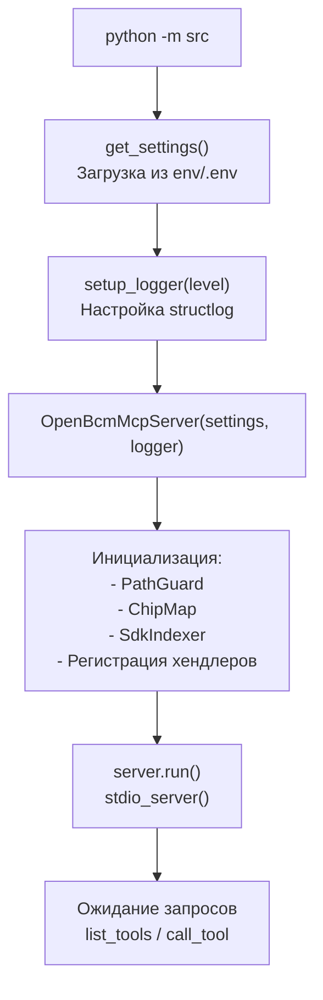

# `__main__.py` — Точка входа

## Назначение

Точка входа в приложение. Создаёт экземпляр `OpenBcmMcpServer` и запускает его через stdio транспорт.

## Реализация

```python
import asyncio
from src.config import get_settings
from src.server.logger import setup_logger
from src.server.mcp_server import OpenBcmMcpServer


async def main() -> None:
    settings = get_settings()
    logger = setup_logger(settings.openbcm_mcp_log_level)
    server = OpenBcmMcpServer(settings, logger)
    await server.run()


if __name__ == "__main__":
    asyncio.run(main())
```

## Поток запуска



## Запуск

```bash
# Прямой запуск
OPENBCM_SDK_PATH=/path/to/sdk python -m src

# Через uv
OPENBCM_SDK_PATH=/path/to/sdk uv run python -m src