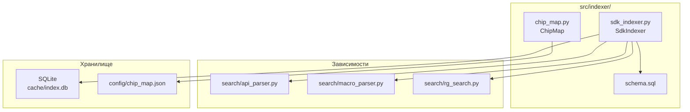

# Модуль индексации (`src/indexer/`)

## Назначение

Модуль индексации отвечает за сканирование SDK, парсинг заголовочных файлов и сохранение структурированной информации в SQLite для быстрого поиска. Реализует ленивую индексацию — индекс строится при первом вызове инструмента.

## Файлы модуля

| Файл | Назначение |
|------|-----------|
| `__init__.py` | Пакетный инициализатор |
| `sdk_indexer.py` | Индексатор SDK: сканирование, парсинг, сохранение в SQLite |
| `chip_map.py` | Загрузка маппинга чипов из JSON-конфига |
| `schema.sql` | SQLite схема базы данных |

## Диаграмма зависимостей



## Поток индексации

```mermaid
flowchart TD
    START["_ensure_indexed()"] --> SCAN["Сканирование include/bcm/*.h"]
    SCAN --> FIND["rg_files() — поиск bcm_* функций"]
    FIND --> PARSE_FUNC["Парсинг деклараций<br/>api_parser"]
    PARSE_FUNC --> SAVE_FUNC["Сохранение в SQLite<br/>functions + function_params"]
    SAVE_FUNC --> SCAN_MACROS["Сканирование всех .h файлов"]
    SCAN_MACROS --> PARSE_MACROS["Парсинг #define<br/>macro_parser"]
    PARSE_MACROS --> SAVE_MACROS["Сохранение в SQLite<br/>macros"]
    SAVE_MACROS --> DONE["✅ Индекс готов"]