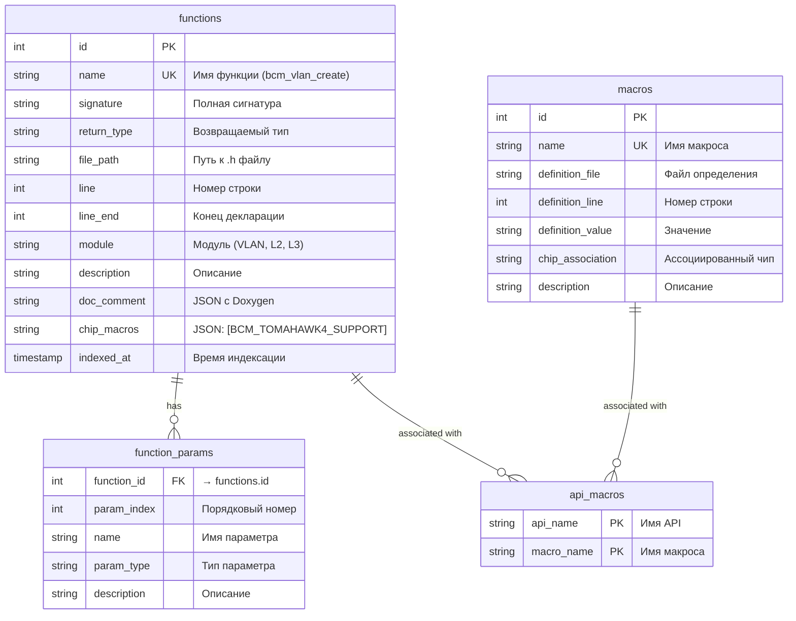

# `schema.sql` — SQLite схема базы данных

## Назначение

Схема базы данных SQLite для хранения индекса SDK. Содержит 4 таблицы: функции, параметры функций, макросы и связь API-макросы.

## ER-диаграмма



## Таблицы

### `functions`

Хранит проиндексированные BCM API функции.

| Колонка | Тип | Описание |
|---------|-----|----------|
| `id` | INTEGER PK | Автоинкрементный ID |
| `name` | TEXT NOT NULL UNIQUE | Имя функции (с уникальностью по file_path) |
| `signature` | TEXT | Полная сигнатура |
| `return_type` | TEXT | Возвращаемый тип |
| `file_path` | TEXT NOT NULL | Путь к заголовочному файлу |
| `line` | INTEGER NOT NULL | Номер строки |
| `line_end` | INTEGER | Конец декларации |
| `module` | TEXT | Модуль (VLAN, L2, L3) |
| `description` | TEXT | Описание API |
| `doc_comment` | TEXT | JSON с Doxygen комментарием |
| `chip_macros` | TEXT | JSON: список chip guard макросов |
| `indexed_at` | TIMESTAMP | Время индексации |

**Уникальность:** `UNIQUE(name, file_path)`

### `function_params`

Хранит параметры функций (связь многие-к-одному с `functions`).

| Колонка | Тип | Описание |
|---------|-----|----------|
| `function_id` | INTEGER FK | ID функции |
| `param_index` | INTEGER | Порядковый номер параметра |
| `name` | TEXT | Имя параметра |
| `param_type` | TEXT | Тип параметра |
| `description` | TEXT | Описание параметра |

**Внешний ключ:** `function_id → functions(id)`

### `macros`

Хранит проиндексированные C-макросы.

| Колонка | Тип | Описание |
|---------|-----|----------|
| `id` | INTEGER PK | Автоинкрементный ID |
| `name` | TEXT NOT NULL UNIQUE | Имя макроса |
| `definition_file` | TEXT | Файл определения |
| `definition_line` | INTEGER | Номер строки |
| `definition_value` | TEXT | Значение макроса |
| `chip_association` | TEXT | Ассоциированный чип |
| `description` | TEXT | Описание |

### `api_macros`

Связь многие-ко-многим между API и макросами.

| Колонка | Тип | Описание |
|---------|-----|----------|
| `api_name` | TEXT NOT NULL | Имя API |
| `macro_name` | TEXT NOT NULL | Имя макроса |

**Первичный ключ:** `(api_name, macro_name)`

## Индексы

```sql
CREATE INDEX IF NOT EXISTS idx_functions_name ON functions(name);
CREATE INDEX IF NOT EXISTS idx_functions_module ON functions(module);
CREATE INDEX IF NOT EXISTS idx_macros_name ON macros(name);
```

## Настройки SQLite

При создании соединения используются следующие PRAGMA:

```python
conn.execute("PRAGMA journal_mode=WAL")    # WAL режим — конкурентное чтение/запись
conn.execute("PRAGMA synchronous=OFF")     # Без синхронизации — выше скорость индексации