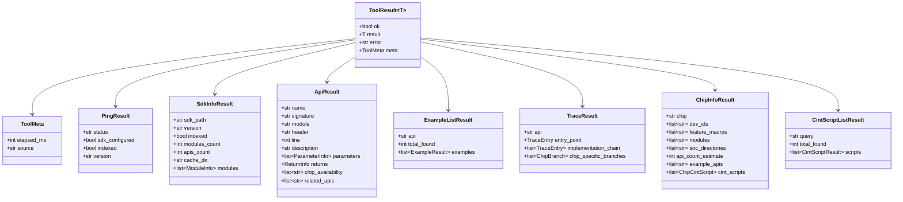

# Модуль моделей данных (`src/models/`)

## Назначение

Модуль содержит Pydantic модели для всех I/O контрактов инструментов. Обеспечивает единообразный формат ответа и валидацию данных.

## Файлы модуля

| Файл | Назначение |
|------|-----------|
| `__init__.py` | Пакетный инициализатор |
| `schemas.py` | Pydantic модели: ToolResult, PingResult, SdkInfoResult, ApiResult, ExampleListResult, TraceResult, ChipInfoResult, CintScriptListResult |

## Диаграмма иерархии моделей



## Универсальная обёртка `ToolResult[T]`

Все инструменты возвращают результат в едином формате:

```python
class ToolResult(BaseModel, Generic[T]):
    ok: bool                    # Флаг успешности
    result: T | None            # Данные (зависит от инструмента)
    error: str | None           # Сообщение об ошибке
    meta: ToolMeta              # Мета-информация
```

### `ToolMeta`

```python
class ToolMeta(BaseModel):
    elapsed_ms: int = 0         # Время выполнения в мс
    source: str = ""            # Источник данных (sqlite, ripgrep, config, internal)