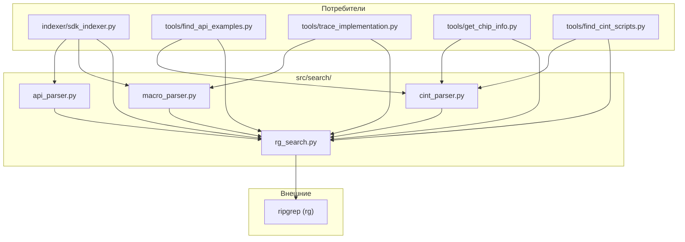

# Модуль поиска (`src/search/`)

## Назначение

Модуль поиска предоставляет утилиты для текстового поиска по SDK и парсинга различных типов файлов. Используется инструментами для поиска API, примеров, CINT скриптов и трассировки.

## Файлы модуля

| Файл | Назначение |
|------|-----------|
| `__init__.py` | Пакетный инициализатор |
| `rg_search.py` | Обёртка над ripgrep (subprocess) |
| `api_parser.py` | Парсинг C-деклараций функций и Doxygen-комментариев |
| `macro_parser.py` | Парсинг #define, #ifdef, chip guards |
| `cint_parser.py` | Парсинг заголовков CINT скриптов |

## Диаграмма зависимостей



## Поток данных

```mermaid
flowchart LR
    QUERY["Поисковый запрос"] --> RG["rg_search()"]
    RG --> JSON["JSON-вывод rg"]
    JSON --> PARSE["_parse_rg_json_output()"]
    PARSE --> MATCHES["RgMatch[]"]

    MATCHES --> AP["api_parser.py<br/>→ FunctionDecl"]
    MATCHES --> MP["macro_parser.py<br/>→ MacroDef / chip guards"]
    MATCHES --> CP["cint_parser.py<br/>→ header / APIs"]