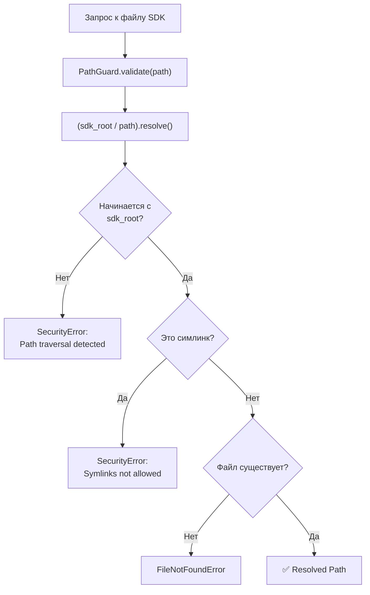

# Модуль безопасности (`src/security/`)

## Назначение

Модуль безопасности реализует sandbox для доступа к файлам SDK. Гарантирует, что сервер работает в read-only режиме и не может получить доступ к файлам за пределами SDK_ROOT.

## Файлы модуля

| Файл | Назначение |
|------|-----------|
| `__init__.py` | Пакетный инициализатор |
| `path_guard.py` | PathGuard — защита от path traversal, симлинков, доступ только внутри SDK_ROOT |

## Принципы безопасности

1. **Read-only** — сервер только читает файлы SDK, никогда не пишет
2. **Sandbox** — все пути проходят через `PathGuard.validate()`
3. **Subprocess whitelist** — разрешена только команда `rg` (ripgrep)
4. **Path traversal** — блокируются `..`, симлинки наружу, абсолютные пути вне SDK_ROOT

## Диаграмма безопасности

## Использование в проекте

- **OpenBcmMcpServer** — создаёт `PathGuard` при инициализации
- **Все инструменты** — используют `PathGuard` для проверки путей к файлам SDK