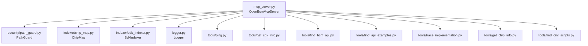

# Модуль сервера (`src/server/`)

## Назначение

Модуль сервера реализует MCP-протокол через stdio-транспорт. Он отвечает за:
- Регистрацию всех 7 инструментов (tools)
- Обработку входящих запросов (`list_tools`, `call_tool`)
- Логирование каждого вызова инструмента
- Инициализацию зависимостей (PathGuard, ChipMap, SdkIndexer)
- Ленивую индексацию SDK при первом вызове

## Файлы модуля

| Файл | Назначение |
|------|-----------|
| `__init__.py` | Пакетный инициализатор |
| `mcp_server.py` | MCP сервер: регистрация хендлеров, диспетчеризация инструментов |
| `logger.py` | Настройка структурированного логирования (structlog) |

## Диаграмма зависимостей



## Поток данных

```mermaid
sequenceDiagram
    participant Client as IDE Agent
    participant Server as OpenBcmMcpServer
    participant Logger as Logger
    participant Tool as Tool Function

    Client->>Server: list_tools
    Server-->>Client: TOOL_DEFINITIONS (7 tools)

    Client->>Server: call_tool(name, arguments)
    Server->>Logger: info("tool_call", tool, params)
    Server->>Server: _dispatch_tool(name, arguments)
    Server->>Tool: вызов функции инструмента
    Tool-->>Server: dict (ToolResult)
    Server->>Logger: info("tool_result", status, elapsed_ms)
    Server-->>Client: CallToolResult (JSON)

    alt ошибка
        Server->>Logger: error("tool_result", error)
        Server-->>Client: CallToolResult (error)
    end